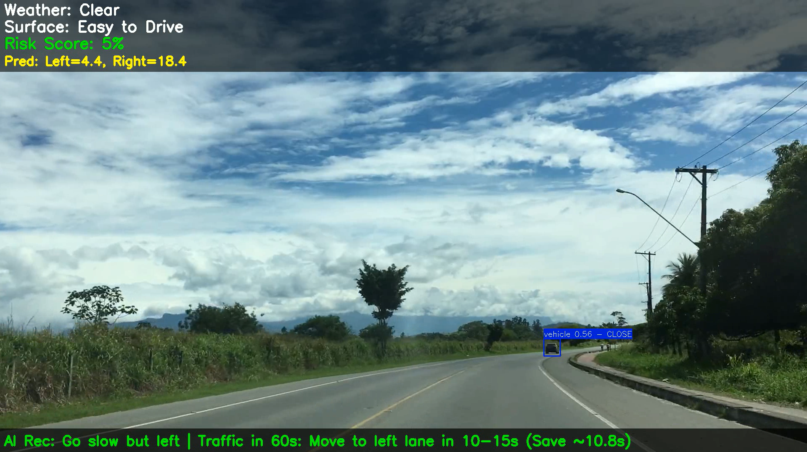
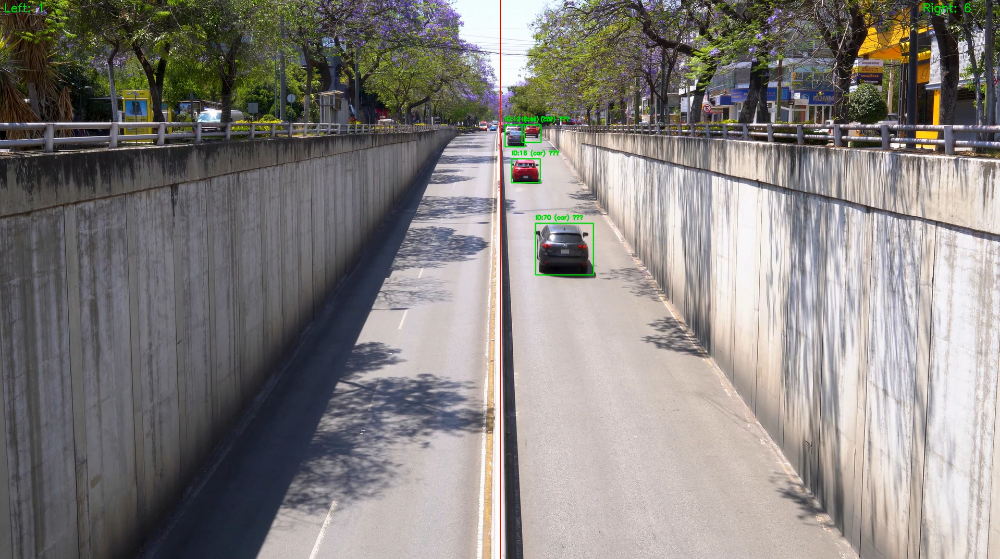

# ADAS and Traffic Prediction System

This repository contains an integrated system for real-time traffic analysis, road condition monitoring, and vehicle flow prediction using deep learning models. It leverages multiple AI models including YOLO for object detection, EfficientNet/ConvNeXt for road surface and weather classification, and an LSTM ensemble with attention mechanisms for traffic prediction.

## Features
- **Object Detection**: Detects vehicles, obstacles, and road signs from dashcam and CCTV footage using YOLO models.
- **Road Surface Classification**: Classifies road conditions (e.g., dry asphalt, wet mud, ice) using a ConvNeXt model.
- **Weather Classification**: Identifies weather conditions (Clear, Fog, Rain) using EfficientNet.
- **Traffic Prediction**: Forecasts vehicle counts on left and right lanes using an LSTM ensemble with red light attention.
- **Real-Time Processing**: Processes alternating dashcam and CCTV video streams with driving recommendations.
- **Risk Assessment**: Calculates a risk score based on weather, surface conditions, and detected objects.
- **Visualization**: Generates training metrics plots and annotated video outputs.

## Repository Structure
- `yolo_training.py`: Trains a YOLOv8 model for object detection.
- `road_surface_classifier.py`: Trains an EfficientNet-based model for road surface classification.
- `lstm_traffic_prediction.py`: Trains an LSTM ensemble for traffic prediction with red light emphasis.
- `integrated_traffic_system.py`: Combines all models for real-time video processing and recommendations.
- `models/`: Directory for pre-trained model weights (not included, see setup instructions).
- `outputs/`: Directory for processed videos and training plots.

## Prerequisites
- **Hardware**: 
  - GPU recommended (NVIDIA CUDA-compatible for PyTorch and TensorFlow).
  - Minimum 16GB RAM for training and inference.
- **Software**:
  - Python 3.8+
  - CUDA 11.x (if using GPU)
  - Dependencies listed in `requirements.txt`

## Installation
1. **Clone the Repository**:
   ```bash
   git clone https://github.com/VijaySingh292/ADAS_Project.git
   ```

2. **Install Dependencies**:
   ```bash
   pip install -r requirements.txt
   ```

3. **Download Pre-trained Models**:
   - Place model weights in the `models/` directory:
     - `best.pt`: YOLO object detection model
     - `road_seg.pt`: YOLO road segmentation model
     - `weather_model.pth`: EfficientNet weather model
     - `final_model.pth`: ConvNeXt surface model
     - `lstm_traffic_model_0.h5`, `lstm_traffic_model_1.h5`, `lstm_traffic_model_2.h5`: LSTM traffic models
     - `scaler.pkl`, `label_encoder_day.pkl`: Preprocessing artifacts
   - Alternatively, train your own models using the provided scripts (see Training section).

## Usage

### Real-Time Video Processing
Run the integrated system on dashcam and CCTV videos:
```bash
python integrated_traffic_system.py
```
- **Inputs**: 
  - Dashcam video: `path/to/dashcam.mp4`
  - CCTV video: `path/to/cctv.mp4`
  - Timestamp: e.g., `"2025-04-03 15:03:00"`
  - Day: e.g., `"Thursday"`
  - Red light status: `"yes"` or `"no"`
- **Outputs**: Annotated videos (`dashcam_output.mp4`, `cctv_output.mp4`) with predictions and recommendations.

### Training Models
1. **YOLO Object Detection**:
   ```bash
   python yolo_training.py
   ```
   - Requires dataset in YOLO format at `/fab3/btech/2022/vijay.singh22b/Final Object Data/`.
   - Outputs trained model weights in `yolo_training_<timestamp>/`.

2. **Road Surface Classifier**:
   ```bash
   python road_surface_classifier.py
   ```
   - Dataset: `ABC(RSCD)/Balanced_RSCD_Dataset/`
   - Outputs: `best_model.pth`, `final_model.pth`, and training plots in `checkpoints2/` and `plots/`.

3. **LSTM Traffic Prediction**:
   ```bash
   python lstm_traffic_prediction.py
   ```
   - Datasets: `train_dataset_7days_3pm_330pm_25200.csv`, `valid_dataset_7days_3pm_330pm_25200.csv`
   - Outputs: `lstm_traffic_model_<i>.h5`, `scaler.pkl`, `label_encoder_day.pkl`, and `enhanced_red_light_metrics.png`.

## Model Details
- **YOLOv8 (Object Detection)**:
  - Detects: animals, vehicles, people, speedbumps, obstacles, signs, traffic lights.
  - Trained on custom dataset with 9 classes.
- **YOLO (Road Segmentation)**:
  - Segments road areas for precise object localization.
- **EfficientNet-B0 (Weather)**:
  - Classes: Clear, Fog, Rain.
- **ConvNeXt-Small (Surface)**:
  - 25+ classes grouped into "Easy to Drive", "Take Precautions", "Dangerous".
- **LSTM Ensemble (Traffic)**:
  - 3 models with red light attention mechanism.
  - Predicts vehicle counts for left and right lanes.

## Output Examples
- **Videos**: Annotated with detected objects, weather, surface conditions, risk scores, and recommendations.
- **Plots**: Training loss, RMSE, prediction vs. actual comparisons, error distributions.

## Training Data
- **Object Detection**: Custom dataset with images and annotations.
- **Road Surface**: Balanced RSCD dataset with train/val/test splits.
- **Traffic Prediction**: CSV files with timestamp, day, red light status, and vehicle counts.
- 
## Results 




## License
This project is licensed under the MIT License - see the [LICENSE](LICENSE) file for details.

## Acknowledgments
- Built with [Ultralytics YOLO](https://github.com/ultralytics/ultralytics), [PyTorch](https://pytorch.org/), [TensorFlow](https://www.tensorflow.org/), and [timm](https://github.com/rwightman/pytorch-image-models).
- Inspired by real-world traffic monitoring systems and Greenshields traffic flow model.

---

### Notes for Customization
- Update file paths to match your environment (e.g., Google Drive paths in the original code).

